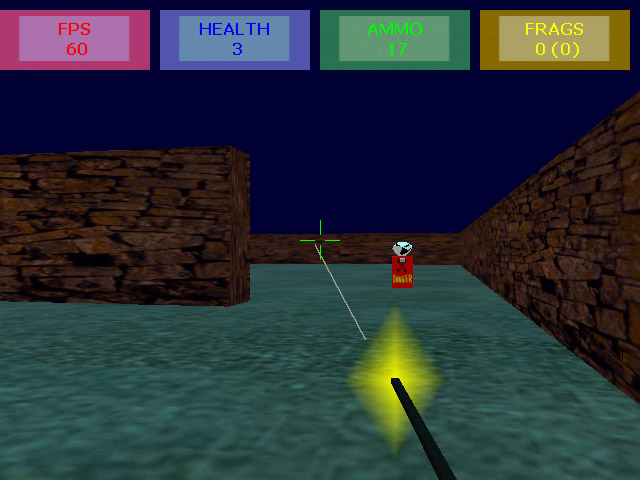



## aaa quake3 clone

### Description

this is a FULL-FEATURED game. uses directX 8. it is a quake 3 type game where u r up against a brutal enemy. no missions, no story, just one on one fight..... unlike other full 3d games posted on this site, this one runs fast even though it has been programmed in vb...... the enemy moves according to way-points, when u hit the enemy it changes direction and runs away, the screen goes red when player gets hit..... etc..... this game is very much playable and enemy a little hard to beat.... PLZ VOTE 4 IT. PLZ LEAVE ANY COMMENTS U HAVE FOR THE GAME OR ME..... looking forward 4 ur feed-back.
 
### More Info
 

             |
---                |---
**Submitted On**   |2005-08-23 00:01:22
**By**             |[aayush kaistha](https://github.com/Planet-Source-Code/PSCIndex/blob/master/ByAuthor/aayush-kaistha.md)
**Level**          |Intermediate
**User Rating**    |4.9 (68 globes from 14 users)
**Compatibility**  |VB 6\.0
**Category**       |[DirectX](https://github.com/Planet-Source-Code/PSCIndex/blob/master/ByCategory/directx__1-44.md)
**World**          |[Visual Basic](https://github.com/Planet-Source-Code/PSCIndex/blob/master/ByWorld/visual-basic.md)
**Archive File**   |[aaa\_quake31926788232005\.zip](https://github.com/Planet-Source-Code/aayush-kaistha-aaa-quake3-clone__1-62290/archive/master.zip)

